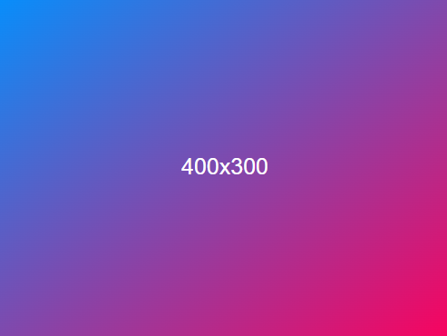

# GradientPlaceholderJS Fill Empty images of any size with beautiful Gradient.🌈
Very light  🪶  and simple and gradient background placeholder 🖼️.



## NPM

To use GradientPlaceholderJS  React framework, simply install via NPM or your preferred package manager:

```npm i gradientplaceholder```

```yarn add gradientplaceholder```

```pnpm add gradientplaceholder```

Next, import the package:

```jsx
import {GradientPlaceholder} from 'gradientplaceholder';
```

### ReactJS / Vite Example

```
import { GradientPlaceholder } from "placeholder";

<GradientPlaceholder width="500" height="500" gradient={['#078efb', '#f9035e']} />
```

### Size

**Required**

Specify the size of the placeholder image by adding the width and height to the component. Example:

```jsx
<GradientPlaceholder width="500" height="500"/>
```
### Gradient

**Optional**

Specify custom gradient in hex formant in the placeholder image by adding your Hex code list upto 4 best option pass only 2 Hex code. Example:

```jsx
<GradientPlaceholder width="500" height="500" gradient={['#078efb', '#f9035e']}/>
```

### Text

**Optional**

Specify custom text in the placeholder image by adding your text. Example:

```jsx
<GradientPlaceholder width="500" height="500" text="Hello World!"/>
```

### Text Color

**Optional**

Specify the text color by adding `color=` to the component. We support HEX values or named values (e.g., white).
Example:

```jsx
<GradientPlaceholder width="500" height="500" text="Hello World!" color="#fff"/>
```

### Background Color

**Optional**

Specify the background color by adding `background=` to the component. We support HEX values or named values (e.g.,
white). Example:

```jsx
<GradientPlaceholder width="500" height="500" background="#000"/>
```
## Authors

- [@Shahid](https://www.github.com/shahidkhans)

## Support
For support, use github [issue](https://github.com/shahidkhans/gradient-placeholder/issues) .

## Acknowledgements
 - Inspired by bick's [placeholder](https://github.com/bick/placeholder) work. Do visit that site.
